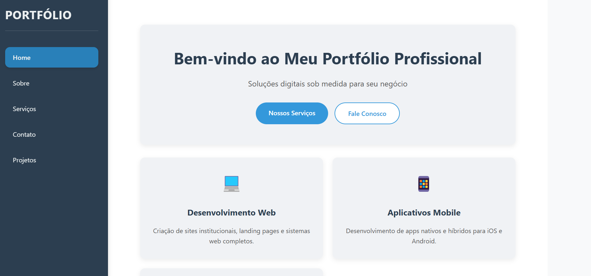

# 📁 Portfólio Pessoal - README

<div align="center">
  
</div>

## 🚀 Sobre o Projeto
Portfólio profissional desenvolvido com arquitetura modular em PHP e Vue.js, permitindo expansão ilimitada de seções.

<div align="center" style="margin: 20px 0;">
  
</div>

## 🛠️ Como funciona a mágica?
1. `index.php` → É o chefe, controla tudo
2. `PathManager.php` → Organiza as páginas
3. `header.php` → Menu lateral que não desaparece
4. Pasta `/api` → Onde coloco novas páginas (ex: `blog.php`)

### 🔍 Explicação Rápida:
1. **`public/`** - Arquivos acessíveis ao usuário final
   - `app.js`: Lógica do menu dinâmico (Vue.js)
   - `styles.css`: Estilos principais

2. **`templates/`** - Partes reutilizáveis
   - `header.php`: Menu que aparece em todas páginas
   - `footer.php`: Rodapé padrão

3. **`api/`** - Páginas de conteúdo
   - Cada `.php` é uma seção do site
   - Adicione mais arquivos para novas seções

4. **`index.php`** - Controla tudo:
   - Decide qual página mostrar
   - Gerencia o sistema completo

### 💡 Dica:
Para adicionar uma nova seção:
1. Crie `nova-secao.php` na pasta `/api`
2. Adicione no `index.php`:
```php
$validPages = ['home', 'projetos', 'nova-secao'];

```

## 📜 Linha do Tempo do Projeto

| 🗓️ Commit | 👤 Autor | 🏷️ Marco Importante |
|-----------|----------|---------------------|
| `Initial commit` | João Gabriel | Fundação do projeto |
| `Mudança para PHP/HTML` | João Gabriel | Transição para arquitetura server-side |
| `CSS base` | Khyarus | Estilo visual inicial estabelecido |
| `Finalizado botões` | Khyarus | Sistema de navegação completo |
| `Markdown e Visual` | Khyarus | Markdown e documentação|

